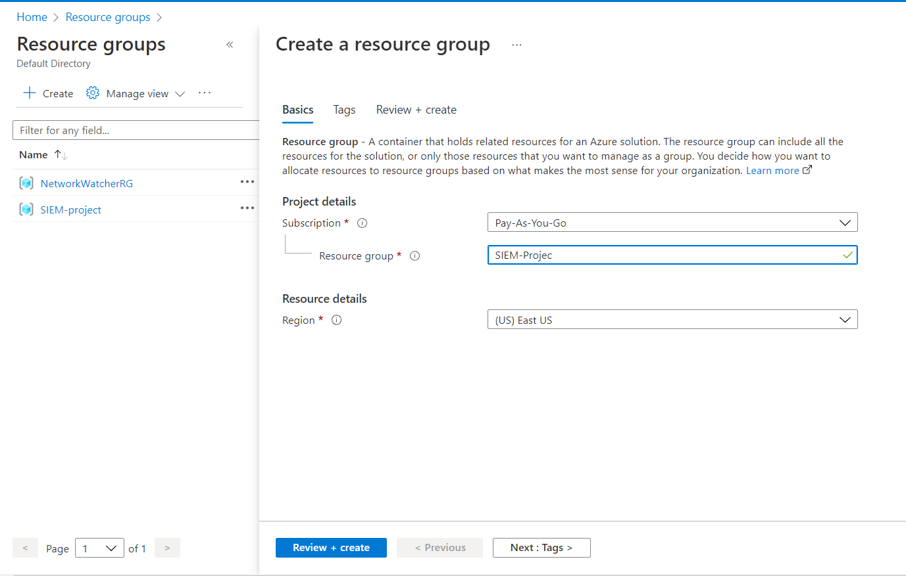

# Using Azure Sentinel to map Failed RDP logins

This document provides a guide on how to utilize Azure log analytics and Sentinel in order to create a heat map of failed RDP login requests on a "honeypot" virtual machine running in Azure.

**Step 1 - Create an Azure Account** 

An Azure account is required to use Azure services and complete this guide.  An account can be created for free and if you've never used it before, you will receive $200 in free credit to use its services.  Without the free credits running the VM for 24 hours to collect failed login attempts cost me less than $2.

1) Create an account [Here](https://azure.microsoft.com/)
2) Navigate to the Azure Portal [portal.azure.com](portal.azure.com)

**Step 2 - Create a Resource Group**

Resource Groups in Azure are a simple way to group related resources under one roof.  We will be adding all resources created in this guide to our one resource group so they are easy to find together. 

1) In the top search bar of the portal, enter "Resource Groups" or select it from the home screen of the portal

2) In the top left, select create
3) Choose your subscription, a name for the resource group, and a region
   
   * Choose a region close to you, or if in doubt just use East-US

 

4) Select "Review + create" and the create

You now have a resource group to use to keep all of your created resources related to this guide in one place.

**Step 3 - Create a Virtual Machine**
